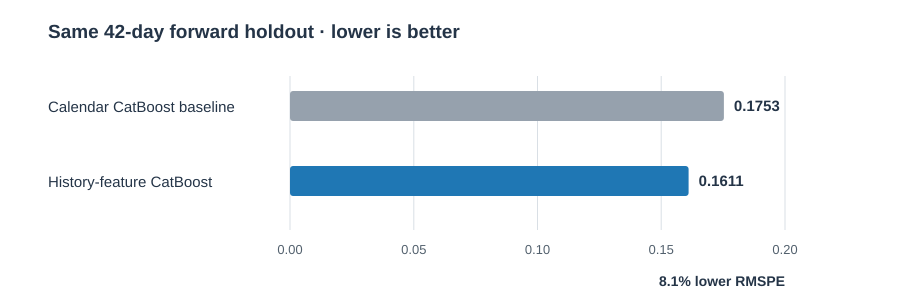
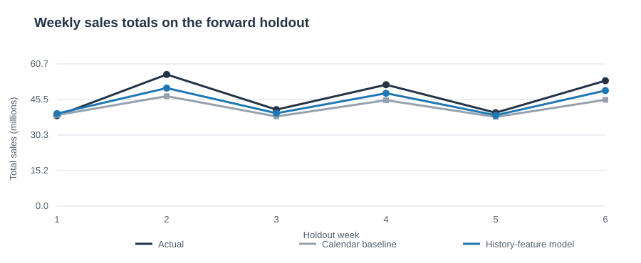
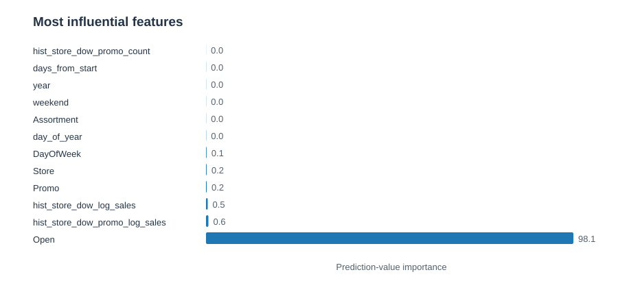

# Rossmann Store Sales — Sales Forecasting

A forward-looking store/day sales forecasting model built with CatBoost. The final model adds **past-only sales history** for each store by weekday and by weekday × promotion. On a chronological 42-day holdout, it reduced RMSPE by **8.1%** versus the calendar-only CatBoost baseline.

## Results



| Model | Holdout RMSPE | Relative change |
|---|---:|---:|
| Calendar-feature CatBoost baseline | 0.175309 | — |
| **History-feature CatBoost model** | **0.161062** | **8.1% lower** |

Lower RMSPE is better. The score excludes actual zero-sales rows, as the competition metric does. It is a local holdout result, not a Kaggle leaderboard score.

### Weekly forecast comparison



### Most influential features



## Validation design

The final 42 calendar days of the labeled data (June 20–July 31, 2015) are held out as a forward forecast. The model trains on earlier dates only. Historical sales features for each training row use preceding observations only; the validation period uses history available before June 20 throughout, so actual holdout sales never enter those features.

The holdout contains 46,830 store/day rows; 40,282 have nonzero actual sales and contribute to RMSPE. Both models use the same split, target transform, CatBoost settings, and metric. The baseline uses calendar, promotion, holiday, store, and competitor features. The final model adds two historical log-sales averages: store × weekday, and store × weekday × promotion. Early stopping selected 725 trees for the final model.


## Model artifact

The trained full-data CatBoost model is included at [`models/rossmann_sales.cbm.xz`](models/rossmann_sales.cbm.xz). It is losslessly compressed to fit GitHub’s regular file-size limit. `src/predict.py` automatically unpacks it to an ignored local cache on first use.

The raw competition CSVs are not included in Git. Download them from [Kaggle](https://www.kaggle.com/competitions/rossmann-store-sales/data) after accepting the competition rules and place `train.csv`, `store.csv`, and any forecast input CSV in `data/raw/`. The Kaggle data is subject to its competition rules.

## Run the project on macOS

```bash
python3 -m venv .venv
source .venv/bin/activate
python -m pip install --upgrade pip
python -m pip install -r requirements.txt
```

Reproduce validation and refit the full-data model:

```bash
python src/train.py --history --iterations 900 --depth 9 --compress-model
```

The script evaluates the final 42 days, selects the best tree count by early stopping, fits on all labeled rows, and saves an uncompressed model to `models/rossmann_sales.cbm`. Add `--compress-model` to also create the lossless `models/rossmann_sales.cbm.xz` archive. To validate without the longer full-data refit, add `--validate-only`. The included compressed model was fitted with 725 trees.

## Make forecasts with the included model

Prepare an input CSV with one row per store/date and these fields: `Store`, `Date`, `DayOfWeek`, `Promo`, `Open`, `StateHoliday`, and `SchoolHoliday`. Store metadata is joined from `data/raw/store.csv`.

```bash
python src/predict.py --input path/to/future_rows.csv --output predictions.csv
```

The output contains the available row identifiers, store, date, and `SalesPrediction`. Closed stores are assigned zero. `predictions.csv`, raw Kaggle files, the local model cache, and the uncompressed model are excluded from Git.

## Repository contents

- `src/train.py` — feature engineering, forward validation, full-data fitting, and model export
- `src/predict.py` — loads the packaged model and creates store/day forecasts
- `models/rossmann_sales.cbm.xz` — compressed, trained model artifact
- `reports/metrics-*.json` and `reports/validation-*-predictions.csv` — measured comparison data
- `reports/make_report_figures.py` — regenerates the README charts
- `reports/validation-notes.md` — detailed metric and split notes
- `requirements.txt` — runtime dependencies
